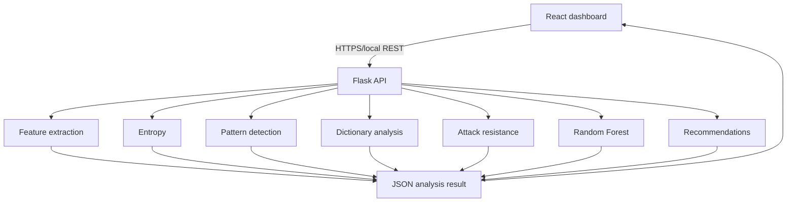

# Architecture

## System overview

## Components

| Layer | Responsibility |
| --- | --- |
| `frontend/` | Visualization, routing, theme, session metadata history |
| `backend/api/` | Validation, health, analyze, compare, metrics |
| `backend/security/` | Domain analysis; password never written to disk |
| `backend/ml/` | Training, evaluation, inference |
| `backend/data/sample/` | Educational common-password list |
| `backend/models/` | joblib model + evaluation JSON |

## API

- `GET /api/health`
- `POST /api/analyze` body `{ "password": "..." }`
- `POST /api/compare` body `{ "password_a": "...", "password_b": "..." }`
- `GET /api/model-info`
- `GET /api/metrics`

Responses never include the submitted secret.

## Trust boundary

The password exists only in the HTTP request body and in-process Python/JS memory for the duration of a single analysis. The frontend clears the input after submit. The backend does not persist it.
